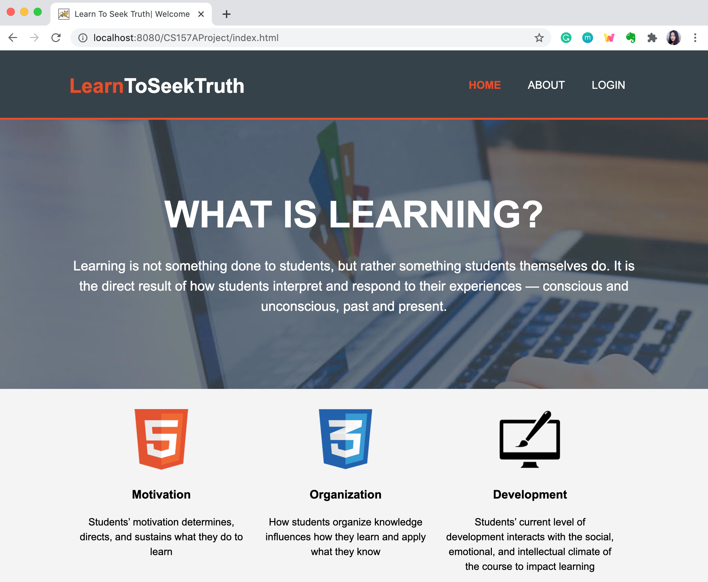

# CS157A-section9-team7 Database Project
San Jose State University
Computer science 
Fall 2020

Written by:

	ZhengYao(Josh) Chin

  	Bella Wei

  	Henry Fan

	

## LearnToSeekTruth
The landing page looks like this: 

### Introduction
This a Java Web application for students to upload, update, delete class notes, and track learning process by applying learning principles.

Our mission is to help college students create significant learning experiences in their college courses. (L. Dee Fink)
We will do so by leveraging learning science and productivity management systems so that students can engage in their courses with less barriers to entry.
A goal of this is to position students so that by the end of their course, they have a portfolio of work that they can leverage in the near and far future. We trust that this is the future of networking; to bring transparency about what / why / how we learn.

* Register Account
* Log Into Account
* Delete Notes
* Update/Edit User Information
* Lecture Note Insertion
* Lecture Update
* Lecture Note Deletion
* Tracking Learning Process

### Installation
Tools: Eclipse EE , MySQL Workbench, Tomcat
1) Set Up Environment WorkBench -> import data Import project157a.sql to MySQL Workbench
2) Clone git repository
3) Import project to Eclipse EE: Go to Eclipse EE - > Import -> Existing Projects into Workspace
4) Configuration 
	a) Configure build path, right click project name -> Build Path -> configure Build Path 
	---> Add External JARS ---> mysql-Connector
	b) Configure database connection
	Find this file config.properties under project folder Java Resources- > src - > config.properties 
	change the inside information to your own database username and password
5) Run index.html on Tomcat server under WebContent - > WEB-INF-> index.html
